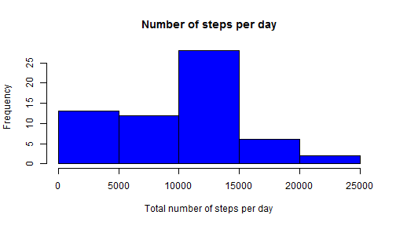
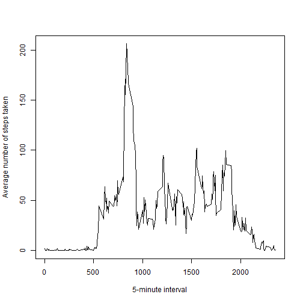
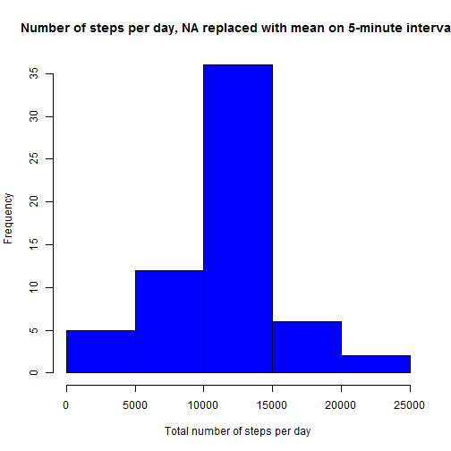
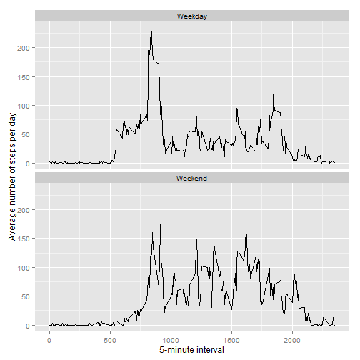

## Loading and preprocessing the data


```r
library(dplyr)
library(ggplot2)

data<-read.csv("./activity.csv")
```

## What is mean total number of steps taken per day?

Calculating the total number of steps taken per day:

```r
TotalSteps<-summarise(group_by(data,date),StepSum=sum(steps,na.rm=T))
```
Building a histogram of the total number of steps taken each day

```r
hist(TotalSteps$StepSum, col="blue", main="Number of steps per day", xlab="Total number of steps per day")
```

 

Mean of the total number of steps taken per day:

```r
meanSteps<-mean(TotalSteps$StepSum)
print(meanSteps)
```

```
## [1] 9354.23
```
Median of the total number of steps taken per day:

```r
medSteps<-median(TotalSteps$StepSum)
print(medSteps)
```

```
## [1] 10395
```

## What is the average daily activity pattern?

Calculating average number of steps taken in 5-minute interval and adding it to the main dataset:

```r
AverageSteps<-summarise(group_by(data,interval),Mean=mean(steps,na.rm=T))
```
Building a plot of the 5-minute interval and the average number of steps taken:

```r
with(AverageSteps,plot(interval,Mean,type="l",xlab="5-minute interval",ylab="Average number of steps taken"))
```

 

Which 5-minute interval, on average across all the days in the dataset, contains the maximum number of steps?

```r
AverageSteps<-arrange(AverageSteps,desc(Mean))
AverageSteps$interval[1]
```

```
## [1] 835
```

## Imputing missing values

Calculating the total number of missing values in the dataset

```r
sum(is.na(data))
```

```
## [1] 2304
```
Creating a new dataset that is equal to the original dataset but with the missing data filled in.

```r
dataNAreplaced<-merge(data,AverageSteps,all=T)
dataNAreplaced$steps[is.na(dataNAreplaced$steps)]<-dataNAreplaced$Mean[is.na(dataNAreplaced$steps)]
dataNAreplaced$Mean<-NULL
```
Building a histogram of the total number of steps taken each day

```r
NTotalSteps<-summarise(group_by(dataNAreplaced,date),StepSum=sum(steps,na.rm=T))
hist(NTotalSteps$StepSum, col="blue", main="Number of steps per day, NA replaced with mean on 5-minute interval", xlab="Total number of steps per day")
```

 

Mean of the total number of steps taken per day:

```r
meanSteps_2<-mean(NTotalSteps$StepSum)
print(meanSteps_2)
```

```
## [1] 10766.19
```
Median of the total number of steps taken per day:

```r
medSteps_2<-median(NTotalSteps$StepSum)
print(medSteps_2)
```

```
## [1] 10766.19
```

## Are there differences in activity patterns between weekdays and weekends?

Adding a column with factor variable indicating weekday/weekend

```r
Sys.setlocale("LC_TIME", "English")
```

```
## [1] "English_United States.1252"
```

```r
data$date<-as.POSIXct(data$date)
data$weekday<-weekdays(data$date)
week<-data$weekday=="Saturday"|data$weekday=="Sunday"
data$weekday[week]<-"Weekend"
data$weekday[!week]<-"Weekday"
data$weekday<-as.factor(data$weekday)
```
Adding column with average number of steps taken, averaged across all weekday days or weekend days

```r
AverageStepsW<-summarise(group_by(data,weekday,interval),MeanWeekday=mean(steps,na.rm=T))
```
Building plot of the 5-minute interval and the average number of steps taken.

```r
g<-ggplot(AverageStepsW,aes(x=interval,y=MeanWeekday))
g+geom_line()+facet_wrap(~weekday,nrow=2,ncol=1)+labs(x="5-minute interval",y="Average number of steps per day")
```

 
